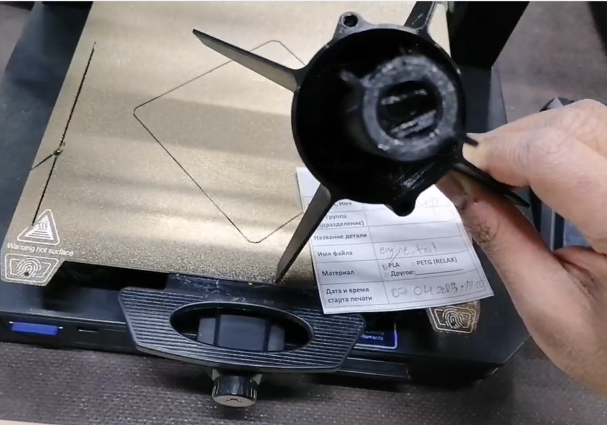

## Launch: 2025-04-13 12:20
[Video](https://drive.google.com/file/d/1womVnZ_m23aot_hYxEVoOb3egwBil4JC/view?usp=sharing)

Capture of skinnier rocket with Engine burn right after clearing guide rod

## Assembled Rocket
- Mass: 330 g
- Length = 66 cm 
- Diameter = 5.0 cm

## 1-Nose
- Mass = 40 g
- Material = PLA
- Length = 12.5

## 2-Body
- Mass = 120 g
- Material = PVC
- Length = 52.5 cm

## 3-Parachute
- Mass = 50 g
- Parachute diameter = 1.0 m

## 4-Shock chord
- Mass = 5 g
- Material = polypropylene
- Length = 150 cm
- Diameter = 3 mm
- Max load = 65 kg 

## 5-Engine
- Loaded Mass = 50 g
- Empty Mass = 16 g
- Engine impulse = 30 Ns
- Engine model = RD-1-30-5

## 6-Tail
- Mass = 65 g
- Material = PLA
- Number of fins = 4
- Shape of fins = trapezium
- Angle relative to rocket long axis = 45 degrees
- Height fin (long along rocket axis) = 8.0 cm
- Width fin (length perpendicular to axis) = 4.5 cm
- Thickness fin = 1.5 mm
- Radius of chamfer at fin-base contact = 4 mm

